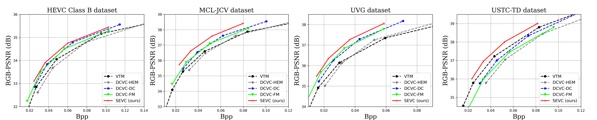
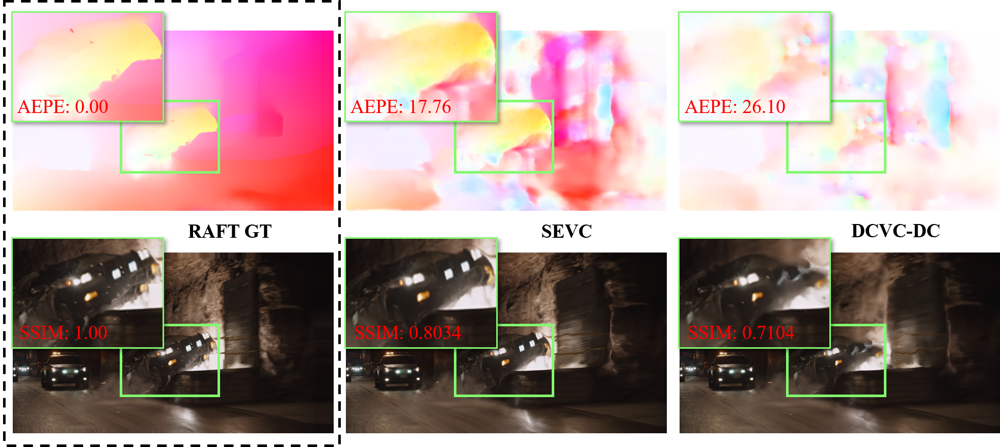

<div align="center">

# Augmented Deep Contexts for Spatially Embedded Video Coding [CVPR 2025]

Yifan Bian, Chuanbo Tang, Li Li, Dong Liu

[[`Arxiv`](https://arxiv.org/abs/2307.12027)] [[`BibTeX`](#book-citation)] [[`Dataset`](https://github.com/EsakaK/USTC-TD)] 

[](https://www.python.org/downloads/release/python-380/) [](https://pytorch.org/get-started/locally/) [](#license)

</div>


## 📌Overview

Our **S**patially **E**mbedded **V**ideo **C**odec (**SEVC**) significantly advances the performance of Neural Video Codecs (NVCs). Furthermore, SEVC possess enhanced robustness for special video sequences while offering additional functionality.

- **Large Motions**: SEVC can better handle sequences with large motions through a progressive motion augmentation. 
- **Emerging Objects**: Equipped with spatial references, SEVC can better handle sequences with emerging objects in low-delay scenes. 
- **Fast Decoding**: SEVC provides a fast decoding mode to reconstruct a low-resolution video. 

### :loudspeaker: News

* \[2025/04/05\]:  Our paper is selected as a **highlight** paper [**13.5%**].


## :bar_chart: Experimental Results

### Main Results
Results comparison (BD-Rate and RD curve) for PSNR. The Intra Period is –1 with 96 frames. The anchor is VTM-13.2 LDB
<div align="center">

|                                                              |   HEVC_B    |   MCL-JCV   |     UVG     |   USTC-TD   |
| :----------------------------------------------------------: | :---------: | :---------: | :---------: | :---------: |
| [DCVC-HEM](https://dl.acm.org/doi/abs/10.1145/3503161.3547845) |    10.0     |     4.9     |     1.2     |    27.2     |
| [DCVC-DC](https://openaccess.thecvf.com/content/CVPR2023/papers/Li_Neural_Video_Compression_With_Diverse_Contexts_CVPR_2023_paper.pdf) |   -10.8   |   -13.0   |   -21.2   |    11.9     |
| [DCVC-FM](https://openaccess.thecvf.com/content/CVPR2024/papers/Li_Neural_Video_Compression_with_Feature_Modulation_CVPR_2024_paper.pdf) |   -11.7   |   -12.5   |   -24.3   |    23.9     |
|                       **SEVC (ours)**                        | **-17.5** | **-27.7** | **-33.2** | **-12.5** |

</div>


### Visualizations

- Our SEVC can get better reconstructed MVs on the decoder side in large motion sequences. Here, we choose [RAFT](https://arxiv.org/pdf/2003.12039) as the pseudo motion label.

<div align="center">

</div>

- Spatial references augment the context for frame coding. For those emerging objects, which do not appear in previous frames, SEVC gives a better description in deep contexts.

<div align="center">

</div>


## Installation

This implementation of SEVC is based on [DCVC-DC](https://github.com/microsoft/DCVC/tree/main/DCVC-family/DCVC-DC) and [CompressAI](https://github.com/InterDigitalInc/CompressAI). Please refer to them for more information.

<details>
  <summary><font size="5">1. Install the dependencies</font></summary><br>

```shell
conda create -n $YOUR_PY38_ENV_NAME python=3.8
conda activate $YOUR_PY38_ENV_NAME

conda install pytorch==1.10.0 torchvision==0.11.0 cudatoolkit=11.3 -c pytorch
pip install pytorch_ssim scipy matplotlib tqdm bd-metric pillow pybind11
```

</details>

<details>
  <summary><font size="5">2. Prepare test datasets</font></summary><br>

For testing the RGB sequences, we use [FFmpeg](https://github.com/FFmpeg/FFmpeg) to convert the original YUV 420 data to RGB data.

A recommended structure of the test dataset is like:

```
test_datasets/
    ├── HEVC_B/
    │   ├── BQTerrace_1920x1080_60/
    │   │   ├── im00001.png
    │   │   ├── im00002.png
    │   │   ├── im00003.png
    │   │   └── ...
    │   ├── BasketballDrive_1920x1080_50/
    │   │   ├── im00001.png
    │   │   ├── im00002.png
    │   │   ├── im00003.png
    │   │   └── ...
    │   └── ...
    ├── HEVC_C/
    │   └── ... (like HEVC_B)
    └── HEVC_D/
        └── ... (like HEVC_C)
```

</details>

<details>
  <summary><font size="5">3. Compile the arithmetic coder</font></summary><br>

If you need real bitstream writing, please compile the arithmetic coder using the following commands.

> On Windows

```
cd src
mkdir build
cd build
conda activate $YOUR_PY38_ENV_NAME
cmake ../cpp -G "Visual Studio 16 2019" -A x64
cmake --build . --config Release
```

> On Linux

```
sudo apt-get install cmake g++
cd src
mkdir build
cd build
conda activate $YOUR_PY38_ENV_NAME
cmake ../cpp -DCMAKE_BUILD_TYPE=Release
make -j
```

</details>


## :rocket: Usage

<details>
  <summary><font size="5">1. Evaluation</font></summary><br>

Run the following command to evaluate the model and generate a JSON file that contains test results. 

```shell
python test.py --rate_num 4 --test_config ./config_F96-IP-1.json --cuda 1 --worker 1 --output_path output.json --i_frame_model_path ./ckpt/cvpr2023_i_frame.pth.tar --p_frame_model_path ./ckpt/cvpr2025_p_frame.pth.tar
```

- We use the same Intra model as DCVC-DC. `cvpr2023_i_frame.pth.tar` can be downloaded from [DCVC-DC](https://github.com/microsoft/DCVC/tree/main/DCVC-family/DCVC-DC).
- Our `cvpr2025_p_frame.pth.tar` can be downloaded from [CVPR2025-SEVC](https://drive.google.com/drive/folders/1H4IkHhkglafeCtLywgnIGR2N_YMVcflt?usp=sharing). `cvpr2023_i_frame.pth.tar` is also available here.

Put the model weights into the `./ckpt`  directory and run the above command.

Our model supports variable bitrate. Set different `i_frame_q_indexes`  and `p_frame_q_indexes` to evaluate different bitrates.

</details>

<details>
  <summary><font size="5">2. Real Encoding/Decoding</font></summary><br>

If you want real encoding/decoding, please use the encoder/decoder script as follows:

**Encoding**
```shell
python encoder.py -i $video_path -q $q_index --height $video_height --width $video_width --frames $frame_to_encode --ip -1 --fast $fast_mode -b $bin_path --i_frame_model_path ./ckpt/cvpr2023_i_frame.pth.tar --p_frame_model_path ./ckpt/cvpr2025_p_frame.pth.tar
```
- `$video_path`: input video path | For PNG files, it should be a directory.
- `$q_index`: 0-63 | Less value indicates lower quality.
- `$frames`: N frames | Frames to be encoded. Default is set to -1 (all frames).
- `$fast`: 0/1 | 1 indicates openning fast encoding mode.
If `--fast 1` is used, only a 4x downsampled video will be encoded.
- 
**Decoding**
```shell
python decoder.py -b $bin_path -o $rec_path --i_frame_model_path ./ckpt/cvpr2023_i_frame.pth.tar --p_frame_model_path ./ckpt/cvpr2025_p_frame.pth.tar
```
- If it is a fast mode, you will only get a 4x downsampled video.
- If it is not a fast mode, you will get two videos: 4x downsampled and full resolution.

</details>

<details>
  <summary><font size="5">3. Temporal Stability</font></summary><br>

To intuitively verify the temporal stability of the two resolution videos, we provide two reconstruction examples with four bitrates:
- BasketballDrive_1920x1080_50: q1, q2, q3, q4 
- RaceHorses_832x480_30: q1, q2, q3, q4

You can find them in [examples](https://pan.baidu.com/s/1KA34wC3jFZzG6A-XipUctA?pwd=7kd4)

They are stored in rgb24 format. You can use the [YUV Player](https://github.com/Tee0125/yuvplayer/releases/tag/2.5.0) to display them and observe the temporal stability.

**Note that**: if you are displaying the skim mode rec, do not forget to set the right resolution, which is a quarter of full resolution.

</details>

## :book: Citation

**If this repo helped you, a ⭐ star or citation would make my day!**

```bibtex
@inproceedings{bian2025augmented,
  title={{Augmented Deep Contexts for Spatially Embedded Video Coding}},
  author={Bian, Yifan and Tang, Chuanbo and Li, Li and Liu, Dong},
  booktitle={Proceedings of the IEEE/CVF Conference on Computer Vision and Pattern Recognition (CVPR)},
  pages={xxx},
  year={2025}
}
```

## :email: Contact

If you have any questions, please contact me: 

- togelbian@gmail.com (main)
- esakak@mail.ustc.edu.cn (alternative)

## License

This work is licensed under MIT license.

## Acknowledgement

Our work is implemented based on [DCVC-DC](https://github.com/microsoft/DCVC/tree/main/DCVC-family/DCVC-DC) and [CompressAI](https://github.com/InterDigitalInc/CompressAI).

